<h1 align="center">🐾 LanePets</h1>

<p align="center">
  Sistema de gestão para petshop — site público, área do cliente e painel administrativo numa aplicação só.
</p>

<p align="center">
  <a href="https://github.com/Miguel33-Dev/lanpets/actions/workflows/dotnet-desktop.yml"></a>
  
  
  
  
  
</p>

<p align="center">
  <a href="#-acesse-online">Acesse online</a> ·
  <a href="#-funcionalidades">Funcionalidades</a> ·
  <a href="#-telas">Telas</a> ·
  <a href="#%EF%B8%8F-arquitetura">Arquitetura</a> ·
  <a href="#-segurança">Segurança</a> ·
  <a href="#%EF%B8%8F-como-executar">Como executar</a> ·
  <a href="docs/PRD.md">Documentação completa</a>
</p>

<p align="center">
  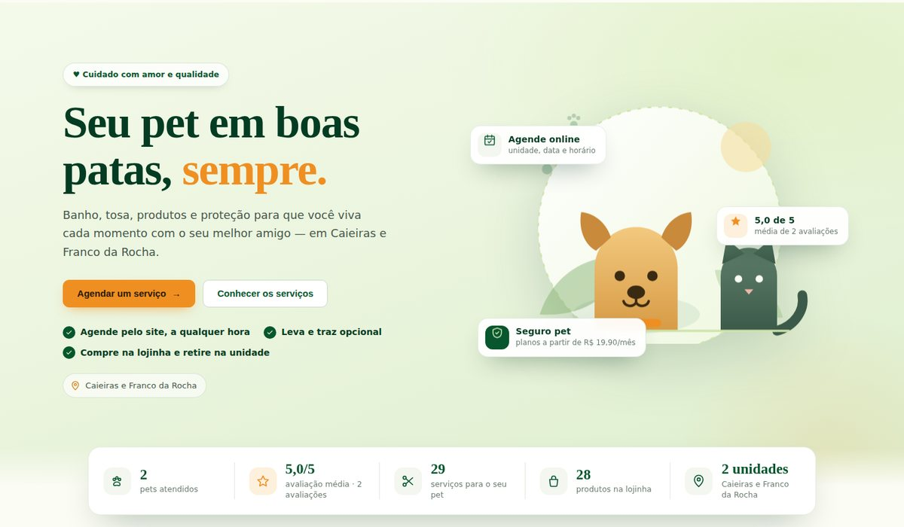
</p>

---

## 🌐 Acesse online

> [!NOTE]
> **Em breve.** O deploy no Railway está em andamento — o link público entra aqui assim que o sistema estiver no ar.
>
> <!-- LINK DA APLICAÇÃO: https://<seu-app>.up.railway.app -->

---

## 📌 Sobre o projeto

O **LanePets** nasceu como projeto de faculdade e virou meu projeto pessoal de backend. A ideia é resolver problemas
reais de um petshop:

- 📞 agendamento por telefone e caderno, sem controle de horário por unidade;
- 📦 estoque sem histórico — ninguém sabe por que um saldo mudou;
- 💸 financeiro espalhado — pagamentos, reembolsos e mensalidades do seguro em lugares diferentes;
- 🐶 o tutor sem um lugar para ver o histórico do pet, os pedidos e os pagamentos.

**Evolução:** PHP → Laravel (MVC + SQLite) → **ASP.NET Core / .NET 10** (versão atual, reescrita do zero).

| | Público | O que faz |
|:-:|---|---|
| 🌐 | **Site público** | o tutor conhece serviços (preço por porte), produtos, seguro pet, unidades e avaliações |
| 👤 | **Área do cliente** | cadastra os pets, agenda, compra na lojinha, acompanha pagamentos, contrata seguro e avalia |
| 🛠️ | **Painel administrativo** | a equipe opera agenda, clientes, estoque, pedidos, financeiro e usuários, com permissão por módulo e por unidade |

---

## 🚀 Funcionalidades

### 🌐 Site público

- Serviços agrupados, com **tabela de preço por porte**.
- Lojinha com busca, categorias, ordenação e selo de estoque.
- Planos do **Seguro Pet** vindos do banco e pedido de contato.
- **Avaliações moderadas** (o tutor aparece como "Nome S.").
- Faixa de **números reais** (pets atendidos, avaliação, serviços, unidades) — sem dado, o cartão some. Nada inventado na tela.

### 👤 Área do cliente

| Função | Como funciona |
|---|---|
| 🔐 **Conta** | e-mail e senha ou **Login com Google**; recuperação de senha por **código de 6 dígitos** por e-mail |
| 🐕 **Meus Pets** | ficha completa (sexo, nascimento, peso, porte, foto, observações) |
| 📅 **Agendar** | 7 etapas (pet → serviços → unidade → data e hora → transporte → pagamento → revisão), **até 6 serviços num agendamento**, respeitando a capacidade da unidade |
| 🗓️ **Meus Agendamentos** | próximo atendimento em destaque, trilha do status, cancelamento enquanto Solicitado/Confirmado |
| 📜 **Histórico** | linha do tempo dos atendimentos concluídos, por pet |
| 🛒 **Loja com sacola** | vários produtos numa compra só (**tudo ou nada**), retirada e pagamento na unidade |
| 💳 **Pagamentos** | extrato com reembolso em análise |
| 🛡️ **Seguro Pet** | contratação em etapas, mensalidade de cada mês e situação (Em dia / Aguardando / Inadimplente) |
| 🎁 **Cartão fidelidade** | 1 selo por atendimento concluído; 10 selos = 1 prêmio |
| ✉️ **Avisos por e-mail** | boas-vindas, agendamento recebido/confirmado/cancelado e lembrete na véspera |

### 🛠️ Painel administrativo

| Módulo | Destaques |
|---|---|
| 📊 **Dashboard** | 8 indicadores com filtro por unidade |
| 📅 **Agendamentos** | lista paginada no servidor, calendário de dia/semana/mês, 5 status, responsável da mesma unidade |
| 👥 **Clientes e pets** | paginados no servidor, detalhe com cartão fidelidade |
| 📦 **Produtos e estoque** | estoque como **livro de movimentações**, alerta de mínimo |
| 🧾 **Pedidos** | Pendente → Confirmado → Entregue, ou Cancelado (devolve o estoque) |
| 🏪 **Unidades** | capacidade por horário, serviços oferecidos, confirmação automática |
| 💰 **Pagamentos** | transições controladas, reembolso, mensalidade automática do seguro |
| 📈 **Relatório financeiro** | exportação em **Excel (.xlsx)** e **PDF** |
| 🔒 **Administração** | usuários e permissões, **log de eventos** (12 meses) e verificação de **integridade do banco** |
| 🔔 **Tempo real** | sino de pendências e atualização do painel via **SignalR** |

---

## 🖼️ Telas

<table>
  <tr>
    <td width="62%">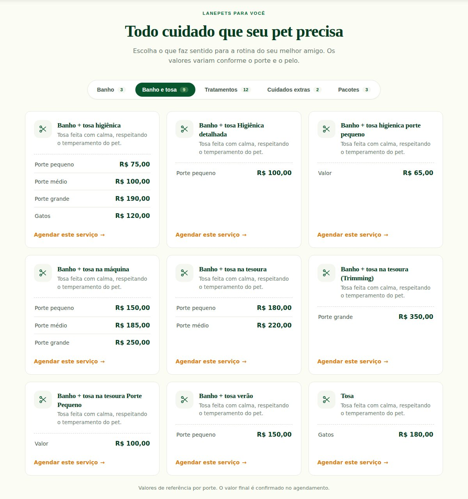</td>
    <td width="38%">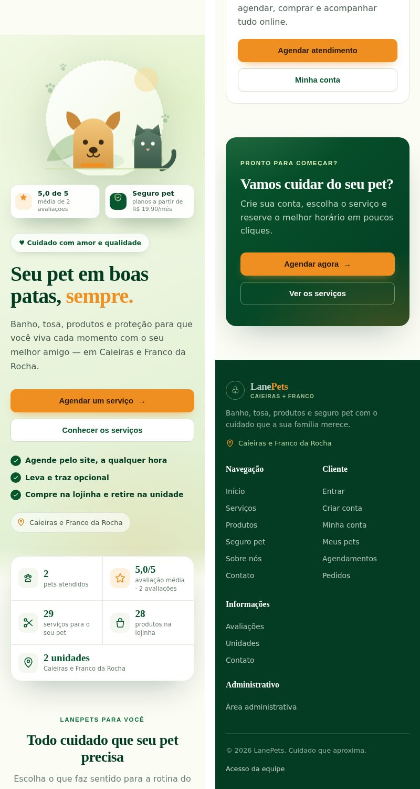</td>
  </tr>
  <tr>
    <td align="center"><sub>Serviços com o preço de cada porte</sub></td>
    <td align="center"><sub>O mesmo site no celular</sub></td>
  </tr>
</table>

<table>
  <tr>
    <td>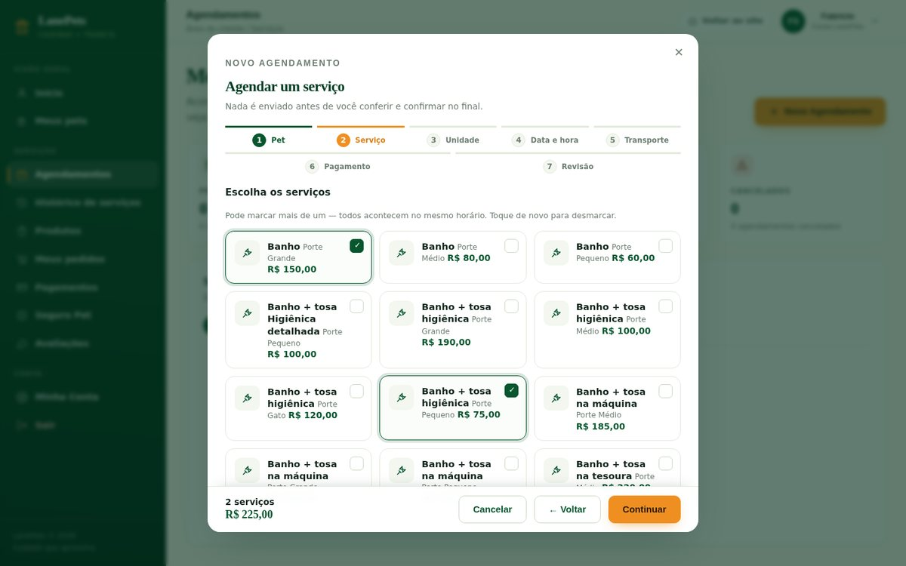</td>
    <td>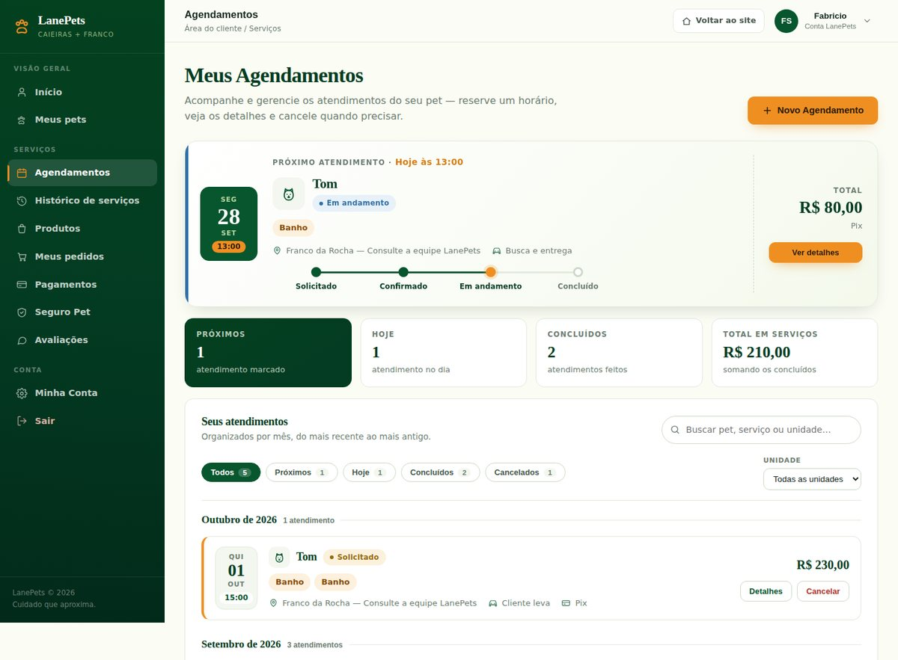</td>
  </tr>
  <tr>
    <td align="center"><sub>Agendar: vários serviços de uma vez</sub></td>
    <td align="center"><sub>Meus Agendamentos</sub></td>
  </tr>
  <tr>
    <td>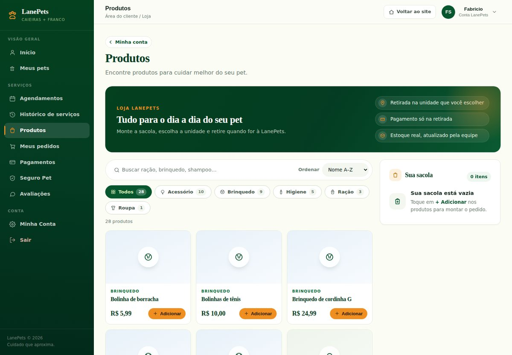</td>
    <td>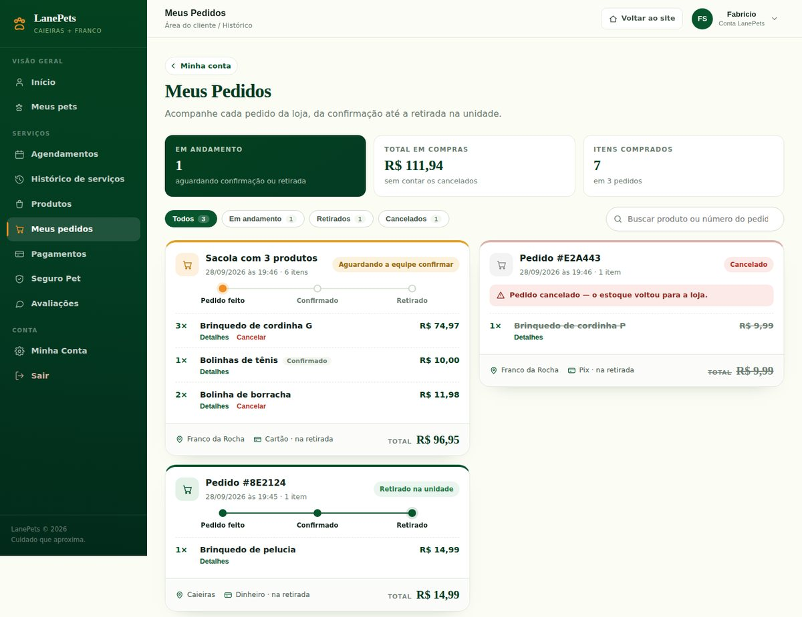</td>
  </tr>
  <tr>
    <td align="center"><sub>Loja com sacola</sub></td>
    <td align="center"><sub>Meus Pedidos</sub></td>
  </tr>
  <tr>
    <td>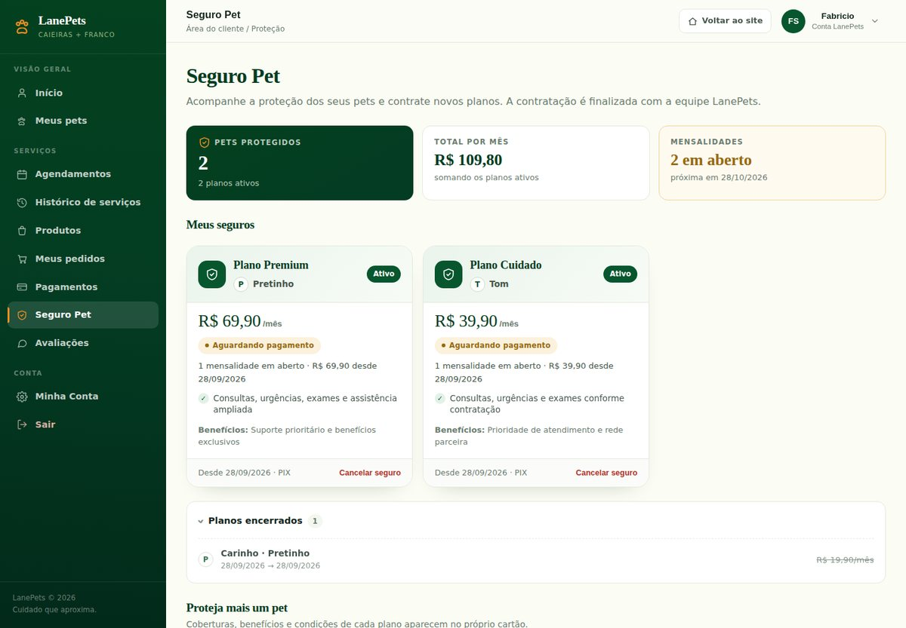</td>
    <td>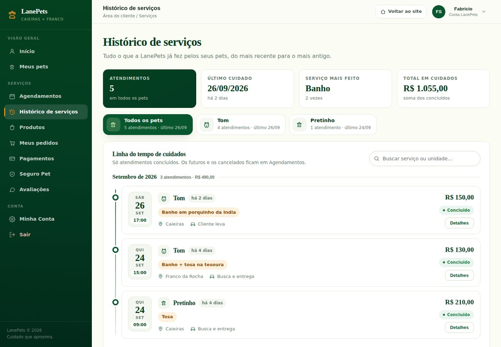</td>
  </tr>
  <tr>
    <td align="center"><sub>Seguro Pet</sub></td>
    <td align="center"><sub>Histórico de serviços</sub></td>
  </tr>
</table>

<table>
  <tr>
    <td>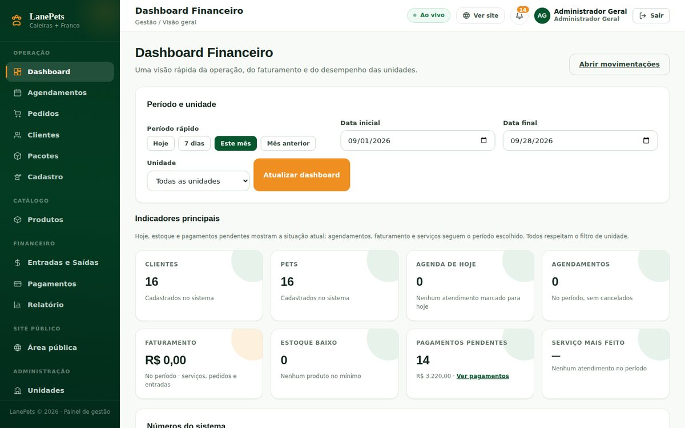</td>
    <td>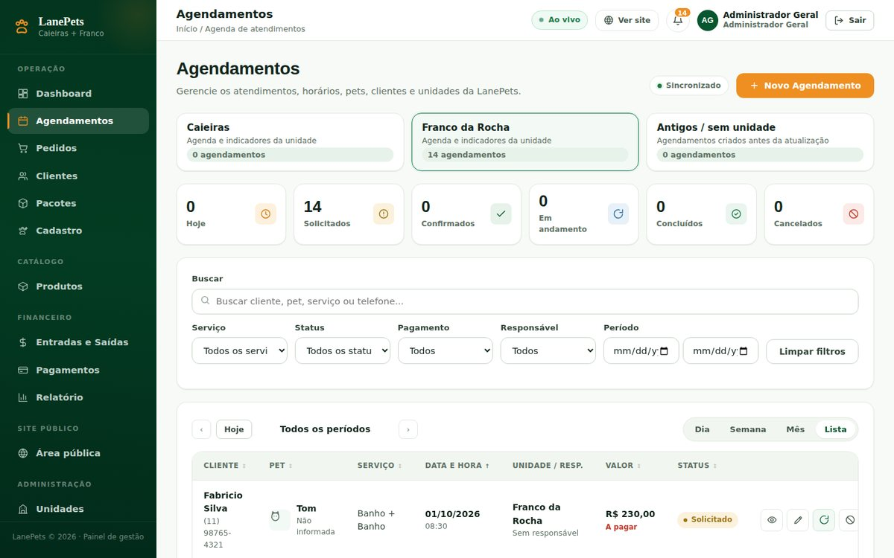</td>
  </tr>
  <tr>
    <td align="center"><sub>Painel: Dashboard</sub></td>
    <td align="center"><sub>Painel: agenda por unidade</sub></td>
  </tr>
  <tr>
    <td>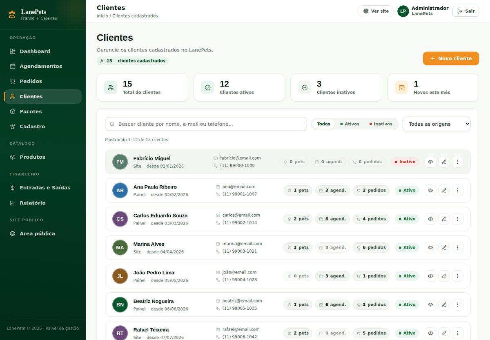</td>
    <td>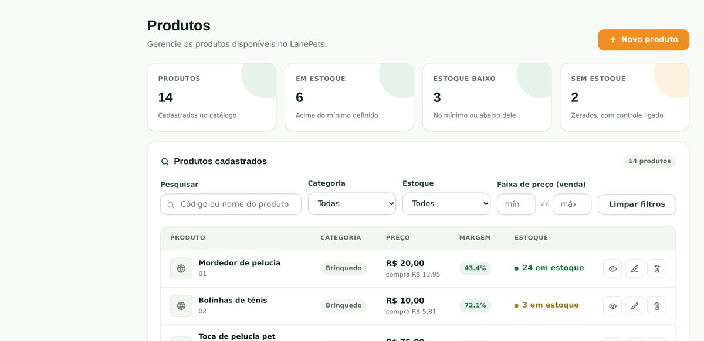</td>
  </tr>
  <tr>
    <td align="center"><sub>Painel: clientes</sub></td>
    <td align="center"><sub>Painel: produtos e estoque</sub></td>
  </tr>
</table>

---

## 🧰 Stack

| Camada | Tecnologia |
|---|---|
| ⚙️ Backend | **C# / ASP.NET Core (.NET 10)** — API REST + frontend servidos pela mesma aplicação |
| 🗄️ Banco | **SQLite** + **Entity Framework Core 10** |
| 🔑 Senhas | BCrypt.Net-Next |
| ⚡ Tempo real | SignalR |
| 🎨 Frontend | HTML + CSS + JavaScript puro, com design system próprio (sem framework) |
| 🔐 Login social | Google Identity Services + validação do token (RS256/JWKS) feita no backend, **sem pacote extra** |
| 📊 Relatórios | gerador de `.xlsx` próprio + PDF |
| 🧪 Testes | xUnit + `WebApplicationFactory` |
| 🔁 CI | GitHub Actions (compila e roda os testes a cada push) |
| 🚀 Deploy | Docker (multi-stage) → Railway |

---

## 🏗️ Arquitetura

<p align="center">
  
</p>

Uma única aplicação **ASP.NET Core** serve o frontend (`wwwroot/`), a API REST (`/api/...`) e o hub SignalR
(`/hubs/lanepets`).

| Camada | Papel |
|---|---|
| **Controllers** | só leem a requisição, checam a permissão, chamam o Service e montam a resposta |
| **Services** | regra de negócio (cálculo puro em classes `static`, estado da requisição em serviços *scoped*) |
| **Middleware** | cabeçalhos de segurança, erro global padronizado e proteção da área administrativa |
| **Workers** | cobrança mensal do seguro, lembrete da véspera e retenção do log, em segundo plano |

Algumas decisões que guiam o projeto:

- **Autorização sempre no backend** — sem permissão é 403, nunca 200 com dados. O frontend só esconde.
- **Identidade vem da sessão**, nunca do corpo da requisição.
- **Resposta num envelope único** `{ ok, data }` e erros com código (`ERR-4000`, `ERR-4030`...) e referência no log.
- **Estoque é um livro:** o saldo só muda por movimentação registrada.
- **Pagamento é entidade**, com transições controladas; a mensalidade do seguro é gerada sozinha.
- **Listas grandes paginam no servidor**, com filtros e busca sem acento.
- **Nenhum número inventado na tela:** sem dado, estado vazio honesto.

Detalhes em [`docs/architecture.md`](docs/architecture.md) e [`docs/rules.md`](docs/rules.md).

---

## 🔒 Segurança

Antes do deploy o projeto passou por uma **auditoria de 19 pontos** ([`docs/security.md`](docs/security.md)):

- Senhas com **BCrypt**; códigos de recuperação guardados só como hash, com validade curta e tentativas contadas.
- **Permissões por módulo e por unidade** no painel (Administrador Geral, Administrador e Funcionário).
- **Proteção contra força bruta:** trava de tentativas por conta e *rate limit* por IP nas rotas sensíveis.
- **Proteção contra XSS:** entrada validada no servidor e saída escapada nas telas.
- **Cabeçalhos HTTP:** CSP, `X-Frame-Options: DENY`, `nosniff`, Referrer/Permissions-Policy; limite de tamanho do corpo.
- Token do painel **só no header**, nunca na URL; cookie `Secure` em HTTPS.
- Login com Google validado de ponta a ponta no backend (assinatura, emissor, público, validade, e-mail verificado).
- **Em produção o app não sobe com senha de exemplo**; segredos só em variáveis de ambiente.

---

## 🧪 Testes automatizados

**270 testes** em `tests/LanePets.Tests` (xUnit + `WebApplicationFactory`). Eles sobem a **aplicação inteira em memória
contra um banco SQLite temporário** — o banco em uso nunca é tocado — e cobrem:

- login do painel e do cliente, recuperação de senha e **Login com Google** (com um Google falso, sem internet);
- clientes, pets, produtos e o livro de estoque;
- agendamentos (capacidade por horário, vários serviços, status, cancelamento);
- pedidos e sacola, pagamentos (transições e reembolso) e cobrança mensal do seguro;
- permissões (403 para quem não tem o módulo ou a unidade);
- segurança (rate limit, cabeçalhos, XSS, token fora da URL);
- listas paginadas, dashboard, relatório financeiro e importação de dados.

```bash
dotnet test tests/LanePets.Tests
```

A cada push o **GitHub Actions** compila o projeto e roda os mesmos testes (selo no topo).

---

## ▶️ Como executar

**Pré-requisito:** [.NET SDK 10](https://dotnet.microsoft.com/download).

```bash
git clone https://github.com/Miguel33-Dev/lanpets.git
cd lanpets
dotnet run --launch-profile LanePets
```

Abra **http://localhost:5180**. No Windows também dá para usar os scripts:

```powershell
./INICIAR-LANEPETS.ps1   # sobe o sistema
./TESTAR-LANEPETS.ps1    # roda os testes
```

> Se o PowerShell bloquear os scripts: `Set-ExecutionPolicy -Scope Process -ExecutionPolicy Bypass`.

- **Banco:** um único `lanepets.db`, criado sozinho **fora da pasta do código** (Windows: `%LOCALAPPDATA%\LanePets`,
  Docker: `/app/data`). Na primeira subida só o catálogo (produtos, serviços, unidades e planos) e o administrador
  inicial são criados. A cada subida é feito um backup automático (10 últimos).
- **Painel:** `/admin-login.html`. A senha do administrador inicial vem de `LanePets__AdminSenhaInicial`.

### ✉️ E-mail (opcional)

Sem SMTP configurado, nada sai para a internet: cada e-mail vira um `.txt` na pasta `emails`, ao lado do banco.
Para enviar de verdade (ex.: Gmail com senha de app), crie o `appsettings.Development.json` — ele está no `.gitignore`:

```json
{
  "LanePets": {
    "Email": {
      "SmtpHost": "smtp.gmail.com",
      "SmtpPorta": "587",
      "SmtpUsuario": "seu.email@gmail.com",
      "SmtpSenha": "senha de app",
      "Remetente": "LanePets <seu.email@gmail.com>"
    }
  }
}
```

### 🔐 Login com Google (opcional)

Crie um cliente OAuth do tipo *Aplicativo Web* no Google Cloud, autorize a origem `http://localhost:5180` e informe só
o **Client ID** (público) em `LanePets:Google:ClientId`. Sem ele, o botão do Google simplesmente não aparece.

---

## 🐳 Docker e deploy no Railway

O `Dockerfile` (multi-stage) já está pronto — o Railway compila e sobe o LanePets direto do GitHub.

1. **New Project → Deploy from GitHub repo** e escolha este repositório.
2. Monte um **volume em `/app/data`** (banco, backups, e-mails e logs — sem ele os dados somem a cada deploy).
3. Em **Variables**, cadastre:

   | Variável | Para quê |
   |---|---|
   | `LanePets__AdminSenhaInicial` | senha forte do administrador inicial |
   | `LanePets__FinancePassword` | senha da área financeira |
   | `LanePets__Google__ClientId` | Login com Google (opcional) |
   | `LanePets__UrlPublica` | link do site nos e-mails (opcional) |
   | `LanePets__Email__*` | SMTP de verdade (opcional) |

4. **Settings → Networking → Generate Domain.** O site abre com HTTPS.

> [!WARNING]
> Em produção o app **não sobe** com a senha de exemplo — o log mostra quais variáveis faltam. `LanePets__Demo=true`
> é só para testar localmente; nunca ligue no ar.

---

## 📁 Estrutura do projeto

```text
LanePetsCSharp/
├── Controllers/   Auth · Public · ClientPortal · AdminStore · AdminSync · AgendaPainel · Pagamentos ·
│                  Unidades · UsuariosAdmin · Eventos · Integridade · Notificacoes · Data
├── Services/      regra de negócio (agendamentos, estoque, pedidos, pagamentos, seguro, e-mail, Google...)
├── Data/          LanePetsDbContext + seed/*.csv (produtos e serviços)
├── Models/        entidades
├── DTOs/          contratos das respostas
├── Middleware/    segurança HTTP · erro global · proteção do painel
├── Hubs/          hub SignalR (tempo real do painel)
├── wwwroot/       páginas HTML, design system (CSS) e JavaScript
├── tests/         LanePets.Tests (Infra · Autenticacao · Operacao · Painel)
├── docs/          PRD, arquitetura, regras, design, tarefas e segurança
├── Dockerfile
└── INICIAR-LANEPETS.ps1 · TESTAR-LANEPETS.ps1
```

---

## 🔮 Próximas melhorias

- [ ] Deploy no Railway com link público
- [ ] Teste completo em produção (cliente → equipe → financeiro)
- [ ] Notificações dentro do site
- [ ] "Criar senha" direto na Minha Conta para quem entrou só com Google
- [ ] Integração com gateway de pagamento (Mercado Pago / Stripe, modo de teste)

---

## 🧑‍💻 Autor

**Fabrício Miguel da Silva** — desenvolvedor com foco em **backend e engenharia de software**.

C# · .NET · Java · Node.js · PHP · SQL · Docker · Git

---

<p align="center">
  Projeto desenvolvido para fins acadêmicos, de aprendizado e de portfólio.
</p>
