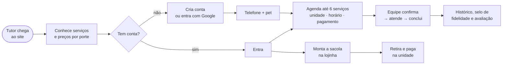

  

  
  
  
  
  
  

  <b>PRD</b> ·
  <a href="architecture.md">Arquitetura</a> ·
  <a href="rules.md">Regras</a> ·
  <a href="design.md">Design</a> ·
  <a href="tasks.md">Tarefas</a> ·
  <a href="memory.md">Memória</a>

> [!NOTE]
> Projeto de faculdade e pessoal de **Fabrício Miguel da Silva**. Atualizado em **29/09/2026**.

---

## 🐾 1. Visão

O **LanePets** é um sistema de gestão para petshop com **três públicos numa aplicação só**:

| | Público | O que faz |
|:-:|---|---|
| 🌐 | **Site público** | o tutor conhece serviços, produtos, seguro pet, unidades e avaliações |
| 👤 | **Área do cliente** | o tutor cadastra os pets, agenda, compra na lojinha, acompanha pagamentos, contrata seguro e avalia |
| 🛠️ | **Painel administrativo** | a equipe opera agenda, clientes, estoque, pedidos, financeiro e usuários, com permissão por módulo e por unidade |

**Unidades atuais:** Caieiras e Franco da Rocha, que vêm do seed, e Jundiaí, cadastrada pelo painel. As unidades vêm
sempre do banco e nunca são escritas à mão.

  
   Página inicial: vantagens reais, cartões que só aparecem com dado e a faixa de números.

## 🎯 2. Problema que resolve

- 📞 Agendamento por telefone e caderno, sem controle de horário por unidade.
- 📦 Estoque sem histórico: não se sabe por que um saldo mudou.
- 💸 Financeiro espalhado: não há um lugar só para pagamentos, reembolsos e mensalidades do seguro.
- 🐶 O tutor não tem onde ver o histórico do pet, os pedidos e os pagamentos.

## 👥 3. Personas

| Persona | Quer | Onde |
|---|---|---|
| 🧑 **Tutor (cliente)** | agendar rápido, comprar e retirar na unidade, ver o histórico do pet | site + área do cliente |
| 👑 **Administrador Geral** | ver tudo e controlar usuários, log e integridade | painel |
| 🧑‍💼 **Administrador comum** | operar os módulos que recebeu | painel |
| 🧑‍🔧 **Funcionário** | atender a agenda **da unidade dele** | painel (teto de permissões) |
| 👀 **Visitante (vitrine)** | conhecer o painel sem gravar nada | painel em modo leitura |

## 🗺️ 4. Jornada principal

## 🌐 5. Site público (`cliente.html`)

- ✨ **Hero:**
  - Vantagens reais: agendar pelo site, leva e traz opcional, comprar e retirar na unidade.
  - Cartões com **nota média** e **"seguro a partir de R$ X/mês"**, que só aparecem quando há dado.
- 📊 **Faixa de números reais:** pets atendidos, avaliação, serviços, produtos e unidades (`GET /api/public/numeros`). Sem dado, o cartão some.
- ✂️ **Serviços agrupados por nome:** tabela de preço por porte, em abas (Banho, Banho e tosa, Tratamentos, Cuidados extras, Pacotes).
- 🛍️ **Lojinha:** busca, categorias, ordenação, selo de estoque e 8 produtos por vez com "ver mais".
- 🛡️ **Seguro pet:** planos vindos do banco e pedido de contato.
- ⭐ **Avaliações moderadas.** Para avaliar é preciso estar logado.
- 📍 **Unidades e contato numa seção:** telefone clicável e "Como chegar" só com endereço de verdade.

<table>
  <tr>
    <td width="62%"></td>
    <td width="38%"></td>
  </tr>
  <tr>
    <td align="center">Serviços agrupados, com o preço de cada porte</td>
    <td align="center">Mesmo site no celular</td>
  </tr>
</table>

## 👤 6. Área do cliente (`minha-conta.html`)

| Função | Como funciona |
|---|---|
| 🔐 **Conta** | e-mail e senha ou **Login com Google** (vincula a conta que já existe pedindo a senha uma vez, ou cria uma nova); recuperação por **código de 6 dígitos**; trocar e-mail ou senha exige a senha atual; avisos por e-mail liga/desliga |
| 📱 **Telefone obrigatório** | para agendar, pedir na loja e contratar o seguro |
| 🐕 **Meus Pets** | ficha completa (sexo, nascimento, peso, cor, porte, foto, observações), wizard em 4 etapas, até 20 pets |
| 📅 **Agendar** | 7 etapas (pet → serviço → unidade → data e hora → transporte → pagamento → revisão); **até 6 serviços**; capacidade da unidade; leva e traz custa R$ 15 cada |
| 🗓️ **Meus Agendamentos** | destaque do próximo atendimento, trilha do status, lista por mês; o cliente cancela enquanto está Solicitado ou Confirmado |
| 📜 **Histórico** | linha do tempo dos concluídos, por pet, com o serviço mais feito e o total |
| 🛒 **Produtos com sacola** | vários produtos numa compra (tudo ou nada, até 20 itens); retira e paga na unidade |
| 📦 **Meus Pedidos** | a compra da sacola num cartão, com a linha do tempo Pedido feito → Confirmado → Retirado |
| 💳 **Pagamentos** | extrato só de leitura, com reembolso em análise |
| 🛡️ **Seguro Pet** | contratação em etapas, mensalidade de cada mês e situação (Em dia / Aguardando / Inadimplente) |
| 🎁 **Cartão fidelidade** | 1 selo por atendimento concluído; 10 selos = 1 prêmio |
| ⭐ **Avaliações** | só com login, do próprio pet, com moderação |

<table>
  <tr>
    <td></td>
    <td></td>
  </tr>
  <tr>
    <td align="center">Meus Agendamentos: próximo atendimento em destaque</td>
    <td align="center">Agendar: vários serviços de uma vez</td>
  </tr>
  <tr>
    <td></td>
    <td></td>
  </tr>
  <tr>
    <td align="center">Loja com sacola</td>
    <td align="center">Meus Pedidos: a sacola num cartão só</td>
  </tr>
</table>

## 🛠️ 7. Painel administrativo

| Módulo | Destaques |
|---|---|
| 📊 **Dashboard** | 8 indicadores com filtro de unidade; valor em dinheiro só com permissão de pagamentos |
| 📅 **Agendamentos** | lista paginada no servidor, calendário de dia, semana e mês, 5 status, responsável da mesma unidade, wizard de criação |
| 👥 **Clientes e pets** | paginados no servidor, detalhe com cartão fidelidade |
| 📦 **Produtos e estoque** | estoque como **livro** de movimentações, alerta de mínimo, foto, visibilidade na loja |
| 🧾 **Pedidos** | Pendente → Confirmado → Entregue, ou Cancelado (devolve o estoque) |
| 🏪 **Unidades** | capacidade por horário, serviços oferecidos, confirmação automática; só são desativadas |
| 💰 **Pagamentos** | transições controladas, reembolso pendente, uma mensalidade por mês no seguro |
| 📈 **Relatório** | exportação em **Excel (.xlsx)** e **PDF** |
| 🌐 **Área pública** | planos de seguro, moderação das avaliações, solicitações |
| 🔒 **Administração** (só o Geral) | usuários e permissões, **Log de eventos** (12 meses), **integridade do banco** (22 verificações) |
| 🔔 **Sino de pendências** | avisa o que espera a equipe agir |
| 👀 **Modo visitante** | só leitura, para vitrine |

<table>
  <tr>
    <td></td>
    <td></td>
  </tr>
  <tr>
    <td align="center">Agenda por unidade, com KPIs e filtros</td>
    <td align="center">Clientes paginados no servidor</td>
  </tr>
</table>

## ⚙️ 8. Requisitos não funcionais

| Tema | Requisito |
|---|---|
| 🔒 **Segurança** | autorização sempre no backend (403, nunca 200 com dados); a identidade vem da sessão; senhas em BCrypt; códigos de uso único só como hash |
| 🧯 **Confiabilidade** | backup automático na subida (10 últimos); `quick_check` do SQLite; e-mail nunca derruba uma operação |
| 🤝 **Honestidade** | nenhum número ou selo inventado na tela; sem dado, estado vazio |
| 📱 **Responsividade** | toda tela conferida a 330, 390, 860 e 1440 px, sem rolagem lateral |
| ✅ **Qualidade** | **242 testes** automatizados (aplicação real e banco temporário) + CI a cada push |
| 🚀 **Produção** | o app não sobe com a senha de exemplo; segredos só em variáveis de ambiente; dados em `/app/data` |

## 🚫 9. Fora do escopo agora

- 💳 **Gateway de pagamento** (Mercado Pago ou Stripe): futuro, **não fazer agora**.
- 🔔 Notificações dentro do site (hoje só e-mail).
- 🏬 Estoque por unidade: o estoque é único, por decisão.

## 🏁 10. Critérios de sucesso

- [ ] O ciclo completo em produção funciona:
  - **Cliente:** Google → pet → agendamento com vários serviços → sacola.
  - **Equipe:** confirma → atende → conclui → entrega o pedido.
  - **Financeiro:** pagamento → Dashboard → Relatório.
- [x] Todos os testes verdes e CI verde (242).
- [ ] Sistema no ar no Railway, com link público, README e LinkedIn atualizados.
