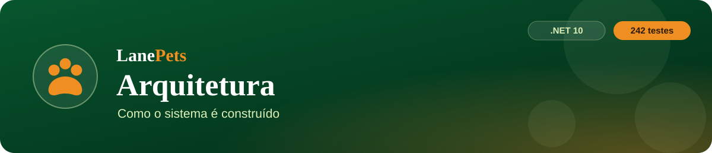
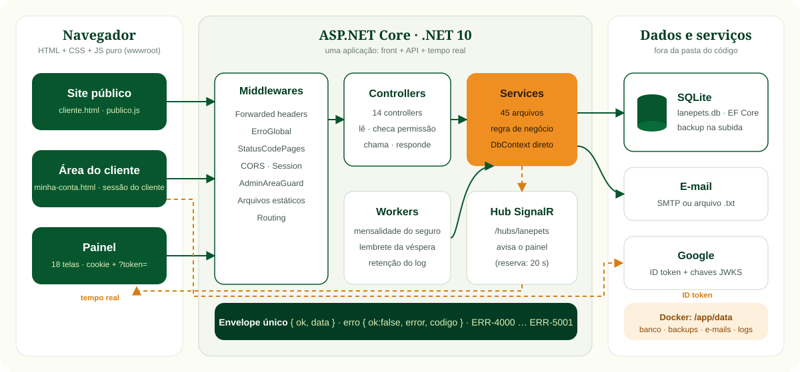
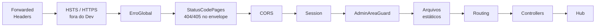
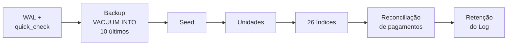
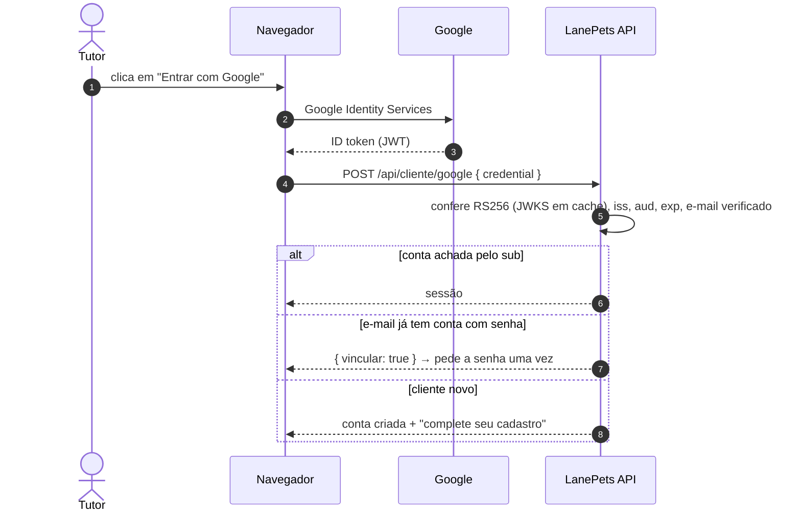
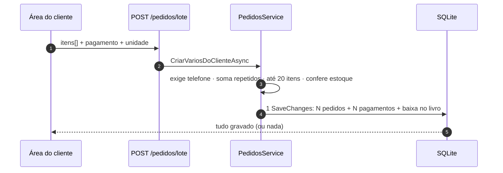
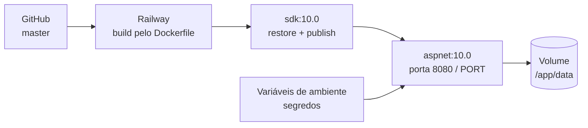

<p align="center">
  
</p>

<p align="center">
  
  
  
  
  
  
</p>

<p align="center">
  <a href="PRD.md">PRD</a> ·
  <b>Arquitetura</b> ·
  <a href="rules.md">Regras</a> ·
  <a href="design.md">Design</a> ·
  <a href="tasks.md">Tarefas</a> ·
  <a href="memory.md">Memória</a>
</p>

> [!NOTE]
> Atualizado em **29/09/2026**. Uma única aplicação **ASP.NET Core (.NET 10)** serve o frontend (HTML, CSS e JS de
> `wwwroot/`), a API REST (`/api/...`) e um hub SignalR (`/hubs/lanepets`) para o tempo real do painel.

---

## 🧭 1. Visão geral

<p align="center">
  
</p>

## 🧰 2. Stack

| Camada | Tecnologia |
|---|---|
| ⚙️ Backend | .NET 10 (`net10.0`, `RootNamespace: LanePets`), ASP.NET Core |
| 🗄️ Banco | SQLite + EF Core 10.0.11 |
| 🔑 Senhas | BCrypt.Net-Next 4.2.0 |
| ⚡ Tempo real | SignalR |
| 🎨 Frontend | HTML + CSS + JavaScript puro, **sem framework** |
| 🔐 Login social | Google Identity Services + validação RS256/JWKS própria, **sem pacote NuGet** |
| 📊 Planilha | `PlanilhaXlsx` própria (ZIP + Office Open XML), **sem pacote** |
| 🧪 Testes | xUnit 2.9.3 + `Microsoft.AspNetCore.Mvc.Testing` 10 |
| 🔁 CI | GitHub Actions "LanePets CI" |
| 🚀 Deploy | Docker → Railway |

## 📁 3. Estrutura de pastas

```text
LanePetsCSharp/
├── Controllers/   AdminStore · AdminSync · AgendaPainel · ApiControllerBase · Auth · ClientPortal · Data ·
│                  Eventos · Integridade · Notificacoes · Pagamentos · Public · Unidades · UsuariosAdmin
├── Services/      regra de negócio (45 arquivos)
├── Data/          LanePetsDbContext + seed/*.csv (produtos e 43 serviços)
├── Models/        Entities.cs
├── DTOs/          contratos conferidos por tela (records)
├── Middleware/    AdminAreaGuard · ErroGlobal
├── Hubs/          hub SignalR
├── wwwroot/       20 páginas · design-system.css · publico.css · conta.css · auth.css · js/ · css/
├── tests/         LanePets.Tests (Infra · Autenticacao · Operacao · Painel)
├── docs/          esta documentação
└── Dockerfile · INICIAR-LANEPETS.ps1 · TESTAR-LANEPETS.ps1 · testar-*.ps1 · README.md
```

## 🔀 4. Pipeline HTTP



Em hospedagem, a porta vem da variável `PORT`. O `Program.cs` termina com `public partial class Program { }`, usado
pelos testes.

## 🧱 5. Camadas

| Camada | Papel | Exemplos |
|---|---|---|
| **Controller** | só lê a requisição, checa a permissão, chama o Service e monta a resposta | `ClientPortalController` |
| **Service `static`** | cálculo puro | `IndicadoresFinanceiros`, `MensalidadesSeguro`, `StatusAgendamento`, `ListaPaginada`, `Validacao` |
| **Service scoped** | estado da requisição | `SyncPainelService`, `ClientesPainelService`, `AgendaPainelService` |
| **Singleton** | recurso compartilhado | `EmailService`, `EventosService` (DbContext próprio), `GoogleTokenService` |
| **Worker** | segundo plano | `CobrancaMensalSeguroWorker` e `LembreteAgendamentoWorker` (de hora em hora), `RetencaoLogWorker` (diário) |

> [!IMPORTANT]
> **Sem Repositories:** os Services usam o `DbContext` direto. Não existe regra de negócio no controller.

<details>
<summary><b>Todos os Services por área</b></summary>

- **Contas e acesso:** Session · Permissao · ContaCliente · ContaGoogle · GoogleLogin · GoogleToken · RecuperacaoSenha · Visitante · Hospedagem
- **Operação:** AgendamentosCliente · Pedidos · Estoque · Pagamentos · SegurosCliente · Avaliacoes · Fidelidade · AvisosCliente · UnidadesRegras · ResponsaveisAgendamento
- **Painel:** SyncPainel · ClientesPainel · AgendaPainel · FormatoPainel · NotificacoesPainel
- **Plataforma:** Banco · Integridade · Importacao · Eventos · RetencaoEventos · Email · PlanilhaXlsx · Seed · DatabaseBootstrap · Normalizador · Csv · Realtime

</details>

## 🗄️ 6. Banco de dados

**Um banco só (`lanepets.db`), fora da pasta do código**, porque o OneDrive corrompia o SQLite.
`ConnectionStrings:LanePetsConnection` tem prioridade.

| Ambiente | Pasta do banco |
|---|---|
| 🪟 Windows | `%LOCALAPPDATA%\LanePets\` |
| 🐧 Linux | `~/.local/share/LanePets/` |
| 🐳 Docker | `/app/data/` |
| 🧪 Testes | `%TEMP%\LanePets.Tests\<id>\` |

- **Sem EF Migrations:** `EnsureCreated()` + `GarantirColunaAsync` / `CREATE TABLE|INDEX IF NOT EXISTS`. Coluna nova é sempre opcional. **Sem foreign key**, com índices e varredura de integridade.



<details>
<summary><b>Entidades (23)</b></summary>

Pet · Cliente · Agendamento · Servico · Produto · EntradaSaida · Pacote · Configuracao · Auditoria* ·
ReconciliacaoMigracao · Depoimento · PlanoSeguro · SolicitacaoSeguro · UsuarioCliente (`GoogleSub`) ·
UsuarioAdministrador · UsuarioAdminPermissao · Unidade · Pedido · EventoLog · MovimentacaoEstoque · Pagamento ·
RecuperacaoSenha · ResgateFidelidade

</details>

## 🔌 7. API

**Envelope único:**

```jsonc
// sucesso
{ "ok": true, "data": { ... } }
// erro
{ "ok": false, "error": "mensagem", "codigo": "ERR-4000", "proibido": false, "timestamp": "..." }  // + "referencia" no 500
```

| Código | Significado |
|---|---|
| `ERR-4000` | regra de negócio |
| `ERR-4001` | corpo em formato errado |
| `ERR-4010` | sem sessão |
| `ERR-4030` | sem permissão |
| `ERR-4040` / `ERR-4050` | rota ou método inexistente |
| `ERR-4990` | cancelada por quem chamou |
| `ERR-5001` | inesperado (com referência no log) |

| Grupo | Rotas principais |
|---|---|
| 👤 **Cliente** `/api/cliente`<br><sub>header `X-LanePets-Client`</sub> | `cadastro` · `login` · `logout` · `senha/esqueci\|redefinir` · `google/config` · `google` · `conta` (+ `/avisos`, `/email`, `/senha`) · `pets` · `catalogo` · `horarios` · `agendamentos` (`servicoIds`, até 6) · `pedidos` · **`pedidos/lote`** · `seguros` · `avaliacoes` |
| 🌐 **Público** `/api/public` | `servicos` · `produtos` · `depoimentos` · `seguros` · `seguros/solicitacoes` · `unidades` · `numeros` |
| 🛠️ **Painel** `/api/admin`<br><sub>`?token=`</sub> | `estado?colecoes=` · `sync/{colecao}` · `resumo` · `relatorio` (+ `excel`) · `clientes` · `pets` · `agenda` · `produtos` · `estoque/movimentacoes` · `entradas-saidas` · `pedidos` · `importar` · `unidades` · `pagamentos` · `integridade` · `eventos` · `usuarios` · `notificacoes` · `senha/esqueci\|redefinir` |
| 🔑 **Auth** `/api` | `health` (`demo`, `visitante`, `google`) · `login` · `login/visitante` · `admin/me` · `logout` |

## 🔄 8. Fluxos principais

### Login com Google



### Sacola da loja



- **Painel antigo × novo:** as telas novas leem por endpoints próprios, paginados no servidor. A gravação continua por `POST /api/admin/sync/{colecao}` com o registro inteiro (`FormatoPainel` é a única tradução banco → painel).
- **Pagamento:** um por agendamento ou pedido, e um por mês no seguro (chave `(Origem, OrigemId, Competencia)`). A situação é calculada na leitura.
- **Log de eventos:** gravado depois do `SaveChanges`; nunca derruba a operação e nunca guarda segredo.

## 🧪 9. Testes

`WebApplicationFactory<Program>` sobe a **aplicação real** contra um banco temporário vazio. O cenário é montado pela
API e o banco só é lido.

| Pasta | O que cobre |
|---|---|
| `Infra/` | `LanePetsApp` (zera SMTP, visitante e Google) · `ColecaoApi` · `Api` (`AdminCom`, `FuncionarioCom`) · `Cenarios` · `GoogleFalso` |
| `Autenticacao/` | login do painel e do cliente, Google (config, token, conta, API, regressão), recuperação de senha, hospedagem, visitante |
| `Operacao/` | agendamentos (inclui vários serviços), pedidos (inclui sacola), pagamentos, seguro e cobrança mensal, avaliações, avisos, fidelidade, confirmação automática |
| `Painel/` | clientes, produtos e estoque, agenda, paginação, dashboard e relatório (Excel), funcionário por unidade, importação, notificações, unidades |

> [!TIP]
> **242 testes** (29/09). Nenhum teste fala com a internet nem manda e-mail real.

## 🐳 10. Hospedagem



- **Imagem:** `ASPNETCORE_ENVIRONMENT=Production` e `TZ=America/Sao_Paulo`.
- **`.dockerignore`:** tira testes, bancos, scripts, `Claude outputs/` e `appsettings.Development.json`.
- **Segredos, só por variável de ambiente:**
  - `LanePets__AdminSenhaInicial`
  - `LanePets__FinancePassword`
  - `LanePets__Google__ClientId`
  - `LanePets__Visitante`
  - `LanePets__Email__*`

> [!WARNING]
> Sem `LanePets:Demo=true`, o app **não sobe** com a senha de exemplo.
