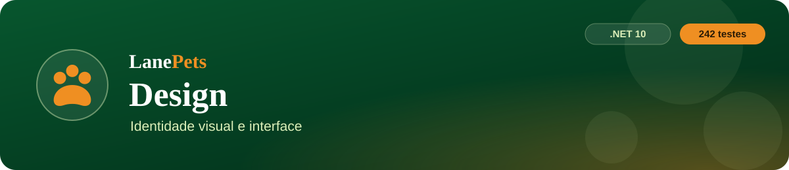
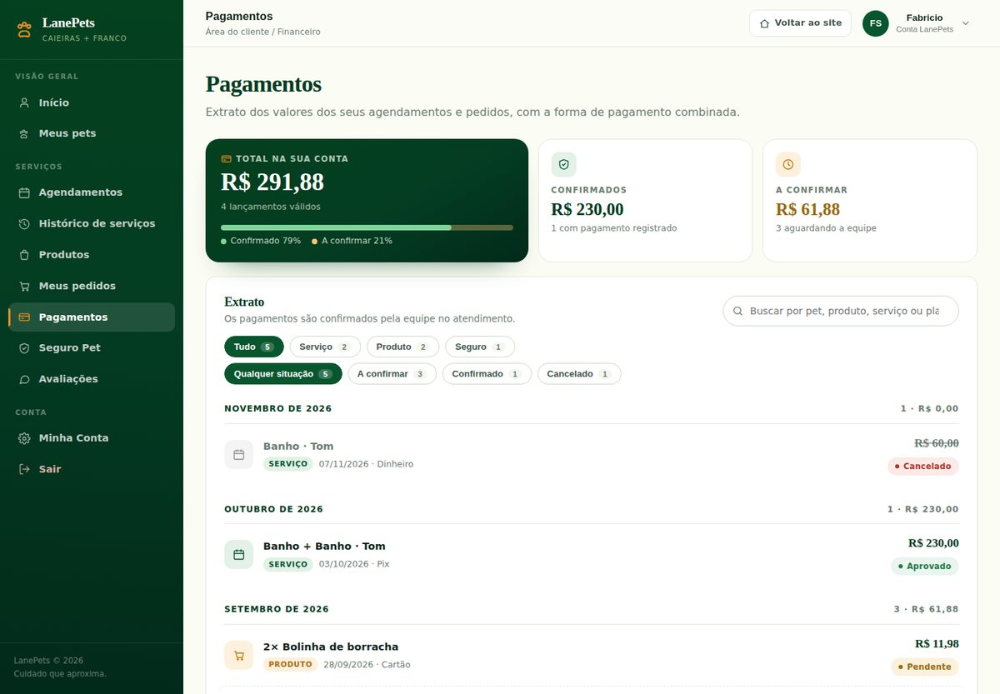
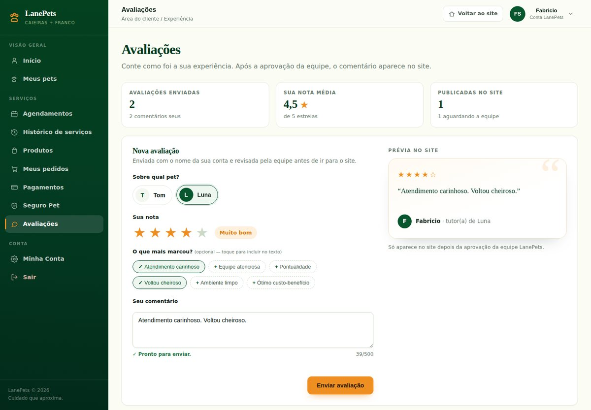

  

  
  
  
  
  

  <a href="PRD.md">PRD</a> ·
  <a href="architecture.md">Arquitetura</a> ·
  <a href="rules.md">Regras</a> ·
  <b>Design</b> ·
  <a href="tasks.md">Tarefas</a> ·
  <a href="memory.md">Memória</a>

> [!NOTE]
> Verde profundo + âmbar, com clima acolhedor de petshop, e **honestidade visual**: nada de selo, nota ou número que o
> sistema não saiba. Atualizado em **29/09/2026**. Regras de front: [`rules.md`](rules.md) §3.

---

  

## 🎨 1. Paleta

| | Papel | Token (painel) | Apelido (site / área do cliente) | Hex |
|:-:|---|---|---|---|
|  | Marca escura | `--brand-900` | `--verde-escuro` | `#033c22` |
|  | Marca | `--brand-700` | `--verde` | `#07562e` |
|  | Interativo | `--brand-500` | `--verde-claro` | `#10804a` / `#0a6b3a` |
|  | Lima (detalhe) | — | `--lima` | `#dcefb9` |
|  | Acento / CTA | `--accent-500` | `--laranja` | `#ef8f22` |
|  | Acento hover | `--accent-600` | `--laranja-forte` | `#d97d12` |
|  | Acento suave | — | `--laranja-suave` | `#fdf0dd` |
|  | Fundo | `--bg` | `--creme` | `#f7faf6` / `#fbfcf4` |
|  | Superfície | `--surface` | `--branco` / `--superficie` | `#ffffff` / `#f3f7ef` |
|  | Borda | `--border` | `--borda` | `#e2eae1` / `#e2eadd` |
|  | Texto | `--ink-900` | `--tinta` | `#12261c` |

**Cor por status:**

| Status | Cor |
|---|---|
| Solicitado · Pendente · Aguardando |  |
| Confirmado · Concluído · Pago · Em dia |  |
| Em andamento |  |
| Cancelado · Recusado · Inadimplente |  |

## 🔤 2. Tipografia

| Fonte | Uso |
|---|---|
| **Fraunces** (serifada) | marca, títulos e valores em destaque no site e na área do cliente |
| **DM Sans** | texto do site e da área do cliente |
| **Manrope** | títulos e números do painel |
| **Inter** | texto do painel |

## 🗂️ 3. Arquivos de estilo

| Arquivo | Onde | Versão |
|---|---|:-:|
| `design-system.css` | **única** fonte do painel: tokens, sidebar, topbar, cards, KPIs, tabelas, filtros, botões, badges, modais, toasts, skeletons, `.tabela-cards`, sino | `v=9` |
| `publico.css` + `js/publico.js` | site público (`cliente.html`), home com escopo `body.home` | `v=13` |
| `conta.css` (`.cc-`) | área do cliente | `v=27` |
| `js/minha-conta.js` | área do cliente | `v=38` |
| `auth.css` (`.lp-`) | telas de login e cadastro | `v=6` |
| `ui-kit.js` | `toast()`, `confirmarAcao()`, `comLoading()`, drawer mobile, rótulos da `.tabela-cards` | — |
| `css/admin-acoes.css` + `js/admin-acoes.js` | ações em ícone + menu `⋮` | — |

## 📐 4. Medidas

| Item | Valor |
|---|---|
| Raios | `--r-sm` 10 · `--r-md` 14 · `--r-lg` 20 · `--r-full` 999 |
| Sombras | `--sombra-sm`, `--sombra-md`, `--sombra-lg` (esverdeadas) |
| Foco | `--anel` — anel verde de 4 px |
| Espaçamento do painel | `--sp-1 … --sp-9` |
| Largura do site | 1200 px (hero até 1240 px) |

## 🧩 5. Componentes e padrões

| Componente | Como é |
|---|---|
| **Botões** | `.botao.primario` laranja com texto escuro (no hover escurece e o texto fica branco) · `.botao.claro` branco com borda · painel: `.btn*`, `.btn-danger-solid`, `.btn.carregando` |
| **Selos de status** | `.cc-selo--ok\|aguarda\|info\|erro\|neutro` (bolinha + texto) |
| **Quadros de resumo** | `.pdx-resumo__item`; o primeiro em destaque, verde escuro com texto claro |
| **Pílulas de filtro** | com contagem; a ativa fica verde |
| **Busca** | campo arredondado com lupa à esquerda (`.pgx-busca`) |
| **Bloco de data** | `.agx-data`: dia da semana, dia grande, mês e hora num chip; a versão grande vem em verde com a hora em laranja |
| **Etiquetas de serviço** | `.agx-servicos`: uma por serviço, laranja suave |
| **Linha do tempo** | Pedidos: feito → confirmado → retirado · Agendamentos: Solicitado → Confirmado → Em andamento → Concluído (atual em laranja) · Histórico: linha vertical com um ponto por atendimento |
| **Estado vazio** | ícone em quadrado suave, título, frase útil e um botão de ação |
| **Carregamento** | esqueletos no lugar de tela branca |
| **Cartão que depende de dado** | nasce `hidden` e só aparece com número real |
| **Ícones** | SVG inline, traço 1.7–1.9, `currentColor` — **nunca emoji** |

## 🖼️ 6. Telas

### Site público

<table>
  <tr>
    <td width="62%"></td>
    <td width="38%"></td>
  </tr>
  <tr>
    <td align="center"><code>.home</code> — serviços em abas, com preço por porte</td>
    <td align="center">Hero e rodapé no celular</td>
  </tr>
</table>

### Área do cliente

<table>
  <tr>
    <td width="50%"></td>
    <td width="50%"></td>
  </tr>
  <tr>
    <td align="center"><code>.agx-</code> Meus Agendamentos — próximo em destaque, lista por mês</td>
    <td align="center"><code>.hsx-</code> Histórico — pets em cartões, linha do tempo</td>
  </tr>
  <tr>
    <td></td>
    <td></td>
  </tr>
  <tr>
    <td align="center"><code>.sl-</code> Loja — sacola fixa ao lado</td>
    <td align="center"><code>.pdx-</code> Meus Pedidos — sacola num cartão, linha do tempo</td>
  </tr>
  <tr>
    <td></td>
    <td></td>
  </tr>
  <tr>
    <td align="center"><code>.sg-</code> Seguro Pet — contratos em cartões</td>
    <td align="center"><code>.pgx-</code> Pagamentos — resumo com barra, extrato por mês</td>
  </tr>
  <tr>
    <td></td>
    <td></td>
  </tr>
  <tr>
    <td align="center">Agendar — vários serviços e barra de ações fixa</td>
    <td align="center">Avaliações — prévia ao vivo</td>
  </tr>
</table>

### Painel administrativo

<table>
  <tr>
    <td width="50%"></td>
    <td width="50%"></td>
  </tr>
  <tr>
    <td align="center">Agenda por unidade, KPIs e filtros</td>
    <td align="center">Dashboard financeiro (valores só com permissão)</td>
  </tr>
  <tr>
    <td></td>
    <td></td>
  </tr>
  <tr>
    <td align="center">Clientes com avatares, contagens e ações</td>
    <td align="center">Produtos com margem e situação do estoque</td>
  </tr>
</table>

## 📱 7. Responsividade

| Parte | Comportamento |
|---|---|
| 🛠️ **Painel** | corte único de **860 px** (menu `⋮`, cards de Agendamentos); tabela larga vira `.tabela-cards` |
| 👤 **Área do cliente** | menu lateral vira drawer; resumos em 2 colunas; cards em coluna, com valor e ações numa linha de baixo |
| 🌐 **Site** | menu vira hambúrguer a 1080 px; serviços em 1 coluna com abas que rolam de lado; lojinha em 2 colunas |

> [!TIP]
> **Conferência obrigatória:** 330 · 390 · 860 · 1440 px, sem rolagem lateral e sem erro de JS.
