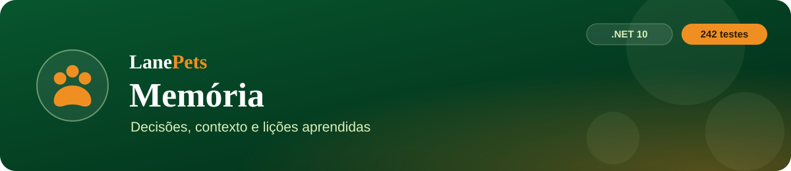
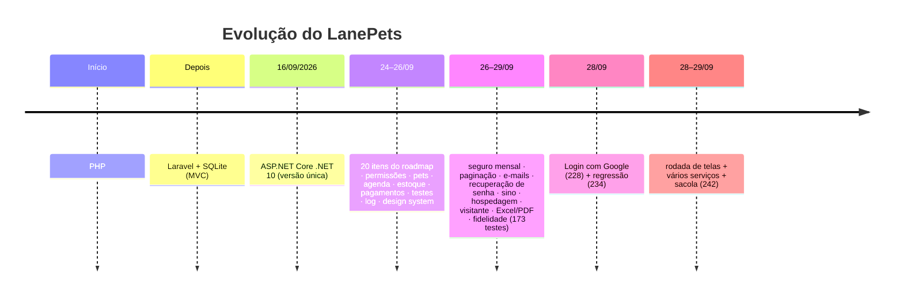
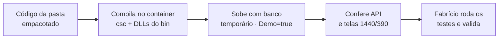

<p align="center">
  
</p>

<p align="center">
  
  
  
  
</p>

<p align="center">
  <a href="PRD.md">PRD</a> ·
  <a href="architecture.md">Arquitetura</a> ·
  <a href="rules.md">Regras</a> ·
  <a href="design.md">Design</a> ·
  <a href="tasks.md">Tarefas</a> ·
  <b>Memória</b>
</p>

> [!IMPORTANT]
> O que já foi decidido, onde paramos e o que já deu errado, para não repetir. **Ler antes de começar qualquer
> trabalho.** Atualizado em **29/09/2026**.

---

## 📍 1. Onde paramos

> [!IMPORTANT]
> **29/09 (noite):** auditoria de segurança em andamento antes do Railway (ver [`security.md`](security.md)).
> Etapa 1 (XSS) ✅ com commit · Etapa 2 (força bruta) entregue — **rodar `./TESTAR-LANEPETS.ps1` (254) e fazer o commit** ·
> depois Etapa 3 (cabeçalhos, cookie Secure, limite de tamanho, health, nome curto nas avaliações) · depois Railway.

| | |
|---|---|
| ✅ **Estado** | desenvolvimento principal, Login com Google e rodada de telas concluídos — **242 testes verdes**, commit e push feitos, CI verde |
| 🚀 **Próxima** | **Tarefa 3 — Deploy no Railway** (ainda não feito) |
| 🔗 **Repositório** | `https://github.com/Miguel33-Dev/lanpets.git`, branch `master` |
| 📂 **Pasta local** | `C:\Users\fabri\OneDrive\Documentos\Novo Projeto\LanePetsCSharp-area-publica-e-seguros\LanePetsCSharp` |

## 🕰️ 2. Histórico do projeto



## 🧭 3. Decisões do Fabrício (valem até ele mudar)

| Tema | Decisão |
|---|---|
| 🔐 **Login com Google** | e-mail que já tem conta com senha → pede a senha **uma vez** para vincular; cliente novo → conta criada direto, sem senha e sem pet, completada depois; **sem pacote NuGet novo** |
| 📱 **Telefone** | obrigatório para agendar, pedir e contratar seguro; o pet pode vir antes; a avaliação não exige |
| 🛡️ **Seguro** | mensalidade gerada sozinha; tolerância de **10 dias**, depois **Inadimplente** (sem cancelar); um `Pagamento` por mês |
| 🏗️ **Arquitetura** | estoque **único** (não por unidade); **sem foreign keys**; **sem Repositories** |
| 👥 **Clientes** | tela inteira fora do estado antigo |
| 🛒 **Loja** | sacola com vários produtos, gravados como um pedido por produto |
| 📅 **Agendamento** | até 6 serviços |
| 📍 **Site** | unidades e contato numa seção só |
| 🎁 **Fidelidade** | 10 selos = 1 banho grátis (configurável) |
| 💳 **Gateway** | só no fim — **não agora** |

## ⚙️ 4. Configuração e ambiente

```powershell
Set-ExecutionPolicy -Scope Process -ExecutionPolicy Bypass   # se o PowerShell bloquear
./INICIAR-LANEPETS.ps1   # http://localhost:5180
./TESTAR-LANEPETS.ps1    # 242 testes
```

| Item | Onde / como |
|---|---|
| 🔑 **Painel local** | `admin@gmail.com` / `123456` — só em desenvolvimento; em produção o app recusa essa senha |
| 🗄️ **Banco real** | `%LOCALAPPDATA%\LanePets\lanepets.db` (fora do OneDrive); o `lanepets.db` da pasta é cópia antiga de 22/09 |
| 🧾 **`appsettings.Development.json`** | fora do git e da imagem: SMTP do Gmail (senha de app colocada por ele), `Visitante: true`, Client ID do Google — os testes ignoram os três |
| 🔐 **Google Cloud** | projeto "LanePets", Google Auth Platform, público Externo **em teste** (ele é usuário de teste); cliente "LanePets Web" com as origens `http://localhost:5180` e `http://localhost`; a chave secreta não é usada e deve ser excluída |
| 🧯 **Erro "ERR-5001 · Ref. XXXX"** | procurar a referência em `%LOCALAPPDATA%\LanePets\logs\erros-AAAA-MM-DD.log` |

## 🚨 5. Incidentes (não repetir)

| Sintoma | Causa | Lição |
|---|---|---|
| "Recurso não encontrado na API." / API nova com 404 ou 405 | app antigo aberto (DLL velha) | mudou `.cs` → Ctrl+C e iniciar de novo |
| `database disk image is malformed` | SQLite dentro do OneDrive | banco fora de pasta sincronizada |
| Tela nova quebrada (`... is not a function`) | JS antigo em cache | subir o `?v=` em todas as páginas |
| Data errada depois das 21h | `toISOString()` (UTC) | data local |
| Hora do pedido 3 h adiantada | `DateTime` UTC sem fuso | `SpecifyKind(Utc).ToString("O")` |
| Cliente e painel marcavam o mesmo horário | unidade pelo nome × pelo id | comparar por `Normalizador.IdUnidade` |
| Editar preço desfazia baixas de estoque | o sync regravava o saldo | saldo só pelo livro |
| Receita para quem não podia ver | regra do dinheiro só em parte dos endpoints | `null` sem `pagamentos:visualizar` em todo endpoint |
| Foto do pet com 0 px | `flex-start` + `absolute` | `align-items: stretch` |
| Página mais larga que o celular | filho de grade sem `min-width:0`; fileira com rolagem | `min-width:0`; `width:0; min-width:100%` |
| Cartão escondido aparecendo vazio | `display` da classe venceu o `[hidden]` | `[hidden]{display:none}` |
| Aviso de telefone sem regra no backend | a tela prometia uma regra inexistente | regra no backend; texto = regra real |
| Selo "Mais escolhido" / "sem carência escondida" | texto sem dado que sustente | fora — só o que o sistema sabe |
| `.git/index.lock` sobrando | IA rodou git na pasta | IA não roda git; commit é do Fabrício |
| Build com 64 erros | `*Tests.cs` em `Claude outputs/` | `DefaultItemExcludes`; teste só em `tests/` |
| Push recusado | README editado no GitHub | `git diff --stat master...origin/master`; nunca `--force` |
| Script `.ps1` bloqueado | política do PowerShell | `Set-ExecutionPolicy -Scope Process -ExecutionPolicy Bypass` |
| `ObjectDisposedException` | disco C: cheio | conferir o espaço antes de caçar bug |

## 🔍 6. Como a IA confere o trabalho



- ✅ **Container da IA:** app compilado com banco temporário; API e telas conferidas com Playwright.
- 🖥️ **Só na máquina dele:** os testes xUnit oficiais e o login com o Google real.
- ⛔ **Nunca** contra o banco real dele.
- 🛑 Para parar o app no container: `kill $(pgrep -x dotnet)`, nunca `pkill -f`.
