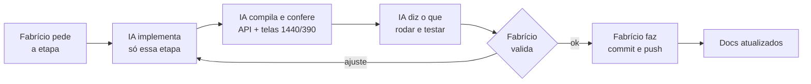

<p align="center">
  
</p>

<p align="center">
  
  
  
  
</p>

<p align="center">
  <a href="PRD.md">PRD</a> ·
  <a href="architecture.md">Arquitetura</a> ·
  <b>Regras</b> ·
  <a href="design.md">Design</a> ·
  <a href="tasks.md">Tarefas</a> ·
  <a href="memory.md">Memória</a>
</p>

> [!IMPORTANT]
> Estas regras valem para **qualquer pessoa ou IA** que mexer no código. O porquê de cada uma está em
> [`memory.md`](memory.md) (incidentes) e em [`architecture.md`](architecture.md). Atualizado em **29/09/2026**.

---

## 🤝 1. Forma de trabalhar

| | Regra |
|:-:|---|
| 1️⃣ | **Uma etapa por vez**, com validação do Fabrício antes de continuar. Quando ele disser "começar a tarefa N", preparar só a primeira etapa. |
| ❓ | Decisão de regra de negócio que aparecer no meio do trabalho: **perguntar antes** de implementar. |
| 🔀 | **Commit e push são sempre do Fabrício.** A IA não roda git na pasta do projeto (deixa `.git/index.lock`). |
| 🔑 | A IA **nunca digita senha** nem coloca segredo em arquivo versionado. |
| 📝 | Ao concluir uma etapa, atualizar [`tasks.md`](tasks.md) e [`memory.md`](memory.md). |



## ⚙️ 2. Backend

<details open>
<summary><b>Banco e dados</b></summary>

1. **Sem EF Migrations.** Usar `EnsureCreated()` + `GarantirColunaAsync` / `CREATE ... IF NOT EXISTS`.
2. **Coluna nova sempre opcional**, que nasce vazia. **Sem foreign key.**
3. **Unidade gravada sempre pelo id.** Comparar por `Normalizador.IdUnidade`.
4. **O saldo do estoque só muda pelo `EstoqueService`** (livro de movimentações). Editar o produto não mexe no saldo.
5. **Pagamento é entidade:** as transições são as de `PagamentosService.PodeIr`. No seguro, um por mês. A situação é calculada, nunca gravada.
6. **Cancelar ≠ excluir.** Unidade só é desativada, e nunca a última ativa.

</details>

<details open>
<summary><b>API e segurança</b></summary>

7. **Envelope único** `{ ok, data }` / `{ ok:false, error, codigo, ... }`.
8. **Autorização é do backend:** 403, nunca 200 com dados. O frontend só esconde.
9. **A identidade vem da sessão**, nunca do corpo. `ClienteId` não existe no contrato de entrada; toda consulta do cliente filtra `ClienteId == cliente.Id` na mesma query.
10. **Projeção explícita** nas respostas: campo interno não vaza.
11. **Dinheiro só com `pagamentos:visualizar`**: sem a permissão, `null`, nunca R$ 0,00.
12. **Perfil mais restrito = teto no backend** (`Pode()` + `VeUnidade()`). O funcionário vê só a unidade dele. Falha fechada.
13. **Segredo de uso único só como hash**, com comparação em tempo constante, validade curta e tentativas contadas.
14. **Produção não aceita senha de exemplo.** Segredo só por variável de ambiente; dados em `/app/data`.

</details>

<details open>
<summary><b>Regra de negócio</b></summary>

15. **Regra de negócio em `Services/`**, com o `DbContext` direto. Sem Repositories. O controller não tem regra.
16. **Validação num lugar só**, antes de tocar na entidade, com mensagem em português (`Validacao`, `PetFicha`, `ImagemDataUri`...).
17. **Erro de negócio:** `throw new Exception("texto")` (tipo base exato) ou `ValidacaoException` → 400 `ERR-4000`. Qualquer outro tipo → 500 `ERR-5001` genérico + referência. Texto técnico só no log.
18. **Nenhum `catch` engole erro** em silêncio.
19. **Nada gravado antes da confirmação final** nos wizards.
20. **Status do agendamento** só via `StatusAgendamento` (Solicitado · Confirmado · Em andamento · Concluído · Cancelado). O cliente cancela só Solicitado ou Confirmado.
21. **Agendar, pedir e contratar seguro exigem telefone** (`ExigirTelefone`).
22. **Sacola = tudo ou nada**, até 20 itens. **Agendamento = até 6 serviços.**
23. **Lista que cresce pagina no servidor** (`ListaPaginada`), com o resumo da base inteira.
24. **Log de eventos:** toda ação relevante registra um evento depois do `SaveChanges`. Nunca senha, token, cartão ou telefone no detalhe.
25. **E-mail nunca derruba a operação.** Os avisos opcionais respeitam `Cliente.ReceberAvisos`.
26. **Nenhum pacote NuGet novo sem decisão** (o Google e o Excel foram feitos sem pacote).

</details>

## 🎨 3. Frontend

| ✅ Fazer | ❌ Não fazer |
|---|---|
| Mostrar só número que veio da API; sem dado, cartão some ou estado vazio | Selo, nota ou frase inventada ("mais escolhido") |
| Subir o `?v=` em **toda** página que carrega o arquivo editado | Editar CSS/JS compartilhado sem subir a versão |
| `localStorage` só para preferência de tela e token do cliente | Dado do sistema no navegador |
| Variação nova de componente no `design-system.css` | Página redefinindo `.btn`, `.card`, `.modal-*`... |
| Nome de unidade por `data-unidades` + `js/marca-unidades.js` | Nome de unidade escrito à mão |
| Ícone em SVG inline | Emoji como ícone |
| `[hidden] { display:none }` junto de toda classe com `display` | Confiar só no atributo `hidden` |
| `min-width:0` em filho de grade; fileira que rola: `width:0; min-width:100%` | Deixar conteúdo largo alargar a página |
| `<div>` como rodapé de card | `<footer>` dentro de card (herda o rodapé do site) |
| Data local para "hoje" | `toISOString()` |
| Localizar registro **por id** | Guardar referência do objeto |
| Escopo `body.home` na home; prefixo próprio por tela (`.agx-`, `.hsx-`, `.pdx-`...) | CSS genérico que vaza para outra página |

> [!TIP]
> **Toda tela é testada a 330, 390, 860 e 1440 px** antes da entrega, sem rolagem lateral e sem erro de JS.

## 🧪 4. Testes

- 📌 Mudança de regra de negócio → **teste junto**, em `tests/LanePets.Tests`.
- 🏗️ A aplicação real sobe com banco temporário. O cenário é montado **pela API** e o banco só é lido.
- 🚫 403 provado com `AdminCom` / `FuncionarioCom`.
- ♻️ Teste que mexe em estado global devolve tudo no `finally`.
- 🌐 Serviço externo é trocado por um falso (`GoogleFalso`). Nenhum teste fala com a internet nem manda e-mail real.
- 👑 Nunca mexer no `admin@gmail.com` em teste: cada teste cria o próprio admin.

> [!CAUTION]
> **Nunca testar contra o banco real do Fabrício.**

## ▶️ 5. Execução

```powershell
# se o PowerShell bloquear o script
Set-ExecutionPolicy -Scope Process -ExecutionPolicy Bypass

./INICIAR-LANEPETS.ps1   # http://localhost:5180
./TESTAR-LANEPETS.ps1    # 242 testes (com o app fechado)
```

| Mudou | O que fazer |
|---|---|
| Arquivo `.cs` | **Ctrl+C** e iniciar de novo (senão aparece "Recurso não encontrado na API.") |
| HTML, CSS ou JS | **Ctrl+F5** no navegador |

- 📂 Rodar sempre **de dentro da pasta do projeto**.
- 🚫 **Nenhum `.cs` solto fora de `tests/`**: o `LanePets.csproj` compila tudo o que acha.
- 🔍 Antes do commit, `git status`: nada de `.fuse_hidden*`, `*.db` ou `Claude outputs/`.
- ⛔ Nunca `git push --force`.
