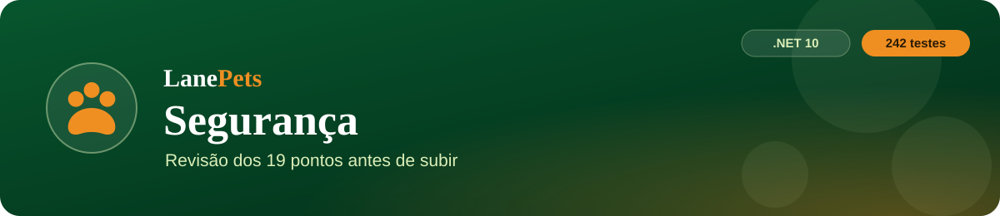

<p align="center">
  
</p>

<p align="center">
  
  
  
</p>

<p align="center">
  <a href="PRD.md">PRD</a> ·
  <a href="architecture.md">Arquitetura</a> ·
  <a href="rules.md">Regras</a> ·
  <a href="design.md">Design</a> ·
  <a href="tasks.md">Tarefas</a> ·
  <a href="memory.md">Memória</a> ·
  <b>Segurança</b>
</p>

> [!NOTE]
> Revisão feita em **29/09/2026**, antes do deploy no Railway. O código foi lido e o app foi rodado num banco de teste;
> os pontos marcados como **confirmado** foram reproduzidos de verdade. Nada foi testado contra o banco real.

---

## Resumo

| # | Ponto | Situação | O que vi |
|:-:|---|:-:|---|
| 1 | `.env` / segredos expostos | ✅ | `appsettings.Development.json` fora do git e da imagem; em produção o app **não sobe** com senha de exemplo. **Histórico do git conferido em 29/09: o arquivo nunca foi commitado.** |
| 2 | Validação só no frontend | ✅ | o navegador só ajuda; quem decide é o backend |
| 3 | Validação no backend | ✅ | `Validacao`, `PetFicha`, `ImagemDataUri`, mensagens em português antes de gravar |
| 4 | SQL injection | ✅ | tudo por EF Core/LINQ (parâmetros); SQL cru só com texto fixo do próprio código |
| 5 | Autenticação fraca | 🟠 | senha 8+ com letra e número, BCrypt, sessão com prazo — **mas sem limite de tentativas** (ver 8) |
| 6 | IDOR | ✅ | toda consulta do cliente filtra pelo dono na mesma query (pets, agendamentos, pedidos, seguros) e há testes; funcionário preso à unidade |
| 7 | Senha direto no banco | ✅ | BCrypt; códigos de recuperação só como hash SHA-256 |
| 8 | Força bruta | 🔴 **confirmado** | 12 senhas erradas seguidas no login do painel → nenhum bloqueio, a 13ª (certa) entrou. Mesmo no login do cliente, na vinculação do Google e na senha financeira |
| 9 | Bloquear durante o envio | ✅ | botões ficam desabilitados enquanto enviam (sacola, agendar, pets, login) |
| 10 | CSRF | ✅ | a API exige o token no header/parâmetro, não só o cookie; cookie `SameSite=Lax` |
| 11 | Upload sem validação | 🟠 | foto validada (JPEG/PNG/WebP, 200 KB, base64 conferido) — **mas a requisição aceita até 30 MB** (padrão do servidor) |
| 12 | Revelando informação | 🟠 | erros genéricos com referência ✅; porém o servidor responde `Server: Kestrel` e `/api/health` mostra nome do banco e tecnologia; o cadastro diz "já existe uma conta com este e-mail" |
| 13 | Dependências vulneráveis | ✅ | bootstrap 5.3.3, jQuery 3.7.1, EF Core 10.0.11, BCrypt 4.2.0 — **`dotnet list package --vulnerable` em 29/09: nenhum pacote vulnerável** |
| 14 | Tokens mal protegidos | 🔴 | token do painel fica no `sessionStorage` e vai na URL (`?token=`) — com o XSS do item extra, dá para roubar a sessão do admin |
| 15 | Rate limit | 🟠 | só a recuperação de senha tem limite (3 pedidos/hora); o resto não tem |
| 16 | Dados sensíveis expostos | 🟠 | respostas com projeção explícita ✅; cartão só 4 dígitos ✅; mas as avaliações públicas mostram o **nome completo** do cliente |
| 17 | SSRF | ✅ | o servidor só chama um endereço fixo (chaves do Google); nenhum endereço vem do usuário |
| 18 | Cookies inseguros | 🟠 | `HttpOnly` e `SameSite` ✅, **sem `Secure`** |
| 19 | CORS | ✅ | só as origens da lista (teste com site estranho: recusado). No Railway, definir `LanePets__CorsOrigins` |
| ➕ | **XSS no painel** (fora da lista) | 🔴 **confirmado** | nome de pet com HTML (``) é aceito no cadastro do site e aparece sem escape em telas do painel |

## 🔴 Corrigir antes de subir

### A. XSS no painel + token no navegador (itens 14 e ➕)

- **Como acontece:** um visitante cria conta no site e cadastra um pet com nome em HTML. O servidor aceita (confirmado: a API do painel devolve `` como nome do pet).
- **Onde aparece sem escape:** `toast()` e `confirmarAcao()` do `ui-kit.js` usam `innerHTML` com o texto recebido (a agenda passa o nome do pet para "O agendamento de … será marcado como…"); a tabela de `clientes_pacote.html` escreve dono, pet, raça, telefone e endereço direto no HTML.
- **Risco:** o script roda com a sessão do administrador, e o token do painel está no `sessionStorage` — dá para roubá-lo.
- **Correção proposta:**
  1. `ui-kit.js`: escapar título e texto no `toast` e no `confirmarAcao` (mensagem vira texto, não HTML).
  2. `clientes_pacote.html` e demais telas com `${…}` em `innerHTML`: passar tudo por `esc()`.
  3. Backend: recusar `<` e `>` em nomes (pet, cliente, raça), como defesa extra.
  4. Cabeçalho **Content-Security-Policy** (item C) para barrar script injetado mesmo se escapar algo.
  5. Teste automático: cadastro com HTML no nome do pet é recusado.

### B. Força bruta e rate limit (itens 5, 8 e 15)

- **Correção proposta:** limitador do próprio ASP.NET Core (sem pacote novo):
  - login do painel, login do cliente, vinculação do Google e senha financeira: **5 tentativas erradas por conta a cada 15 minutos** + limite por IP;
  - cadastro e pedido de código: limite por IP;
  - resposta `429` com mensagem clara ("Muitas tentativas. Aguarde alguns minutos.") e evento no Log;
  - testes automáticos do bloqueio.

## 🟠 Ajustar (rápido)

| Item | Ajuste |
|---|---|
| **C. Cabeçalhos de segurança** | `Content-Security-Policy`, `X-Content-Type-Options: nosniff`, `X-Frame-Options: DENY`, `Referrer-Policy`, `Permissions-Policy`; tirar o `Server: Kestrel` |
| **D. Cookie** | `Secure` no `lanePetsAdmin` e no cookie de sessão em produção |
| **E. Tamanho da requisição** | limite de ~2 MB nas APIs (a foto maior tem 200 KB) — evita derrubar o servidor com envio gigante |
| **F. `/api/health`** | em produção, devolver só o necessário (`ok`, `demo`, `visitante`, `google`) |
| **G. Avaliações públicas** | mostrar "Fabrício S." em vez do nome completo |
| **H. Token na URL** | aceitar o token do painel também por header e ir trocando as telas aos poucos (não bloqueia o deploy) |

## ✅ Conferido na máquina do Fabrício (29/09) — tudo limpo

```powershell
# 1. o arquivo de segredos nunca entrou no git? (tem que sair vazio)
git log --all --oneline -- appsettings.Development.json

# 2. nenhum pacote com vulnerabilidade conhecida
dotnet list package --vulnerable
dotnet list tests/LanePets.Tests package --vulnerable
```

Se o primeiro comando mostrar algum commit, a senha de app do Gmail precisa ser **trocada no Google** (o arquivo já
está no `.gitignore`, mas o histórico guarda).

## Plano sugerido (uma etapa por vez)

| Etapa | O que | Testes novos |
|:-:|---|:-:|
| 1 | ✅ **A — XSS**: escapar `ui-kit.js` e as telas do painel, recusar HTML nos nomes | sim |
| 2 | ✅ **B — força bruta / rate limit** nos logins, cadastro e códigos | sim |
| 3 | ✅ **C, D, E, F, G** — cabeçalhos, cookie `Secure`, limite de tamanho, health enxuto, nome curto nas avaliações | sim |
| 4 | ✅ **H** — token por header no painel | sim |

## Etapa 3 — cabeçalhos, cookie, tamanho, health e nome curto (29/09)

| Item | O que mudou | Onde |
|---|---|---|
| C | Toda resposta sai com `Content-Security-Policy`, `X-Content-Type-Options: nosniff`, `X-Frame-Options: DENY`, `Referrer-Policy: strict-origin-when-cross-origin` e `Permissions-Policy` (câmera, microfone, localização e pagamento desligados). Sem `Server: Kestrel`. | `Middleware/SegurancaHttpMiddleware.cs`, `Program.cs` |
| D | Cookie `lanePetsAdmin` com `Secure` quando a requisição chega por HTTPS (no Railway, pelo `X-Forwarded-Proto`); em `http://localhost` continua sem, para o login local funcionar. Cookie de sessão com `SameAsRequest`. | `AuthController`, `Program.cs` |
| E | Corpo acima de **2 MB** → `413 ERR-4130` ("O envio é grande demais…"). A importação do navegador (`/api/admin/importar`) tem teto próprio de **20 MB**. Configurável: `LanePets:Seguranca:TamanhoMaximoKB` / `TamanhoMaximoImportacaoKB`. | `SegurancaHttpMiddleware`, `ErrosApi` |
| F | `GET /api/health` devolve só `ok`, `demo`, `visitante` e `google`. | `AuthController.Health` |
| G | Avaliações públicas mostram "Fabrício S." (primeiro nome + inicial do último sobrenome). O painel continua com o nome completo. | `Services/NomePublico.cs`, `PublicController` |

**Limite conhecido da CSP:** várias telas do painel ainda têm `<script>` e `onclick` no próprio HTML, então
`script-src` leva `'unsafe-inline'`. A política continua barrando script de outro site, envio de dados para fora
(`connect-src`), `<object>`, `<base>`, formulário para fora e o site dentro de iframe. Tirar os scripts inline fica
como melhoria futura.

Testes: `tests/LanePets.Tests/Autenticacao/CabecalhosSegurancaTests.cs` (5 fatos + 5 casos de nome curto).

## Etapa 4 — token do painel no header (29/09)

- As telas do painel mandam o token em **`X-LanePets-Admin`** (e o da senha financeira em **`X-LanePets-Financeiro`**);
  nenhuma URL leva mais `?token=` — ele não fica no histórico do navegador, nos logs de acesso nem no `Referer`.
- Backend: `Services/TokenPainel.cs` + `PermissaoService.Token()` — o header tem prioridade; `?token=` e `token` no corpo
  continuam aceitos por compatibilidade (aba aberta com JS antigo). O cookie `lanePetsAdmin` sozinho **continua sem
  valer** para a API (CSRF: outro site faz o navegador mandar cookie, mas não um header).
- Telas: `admin-dados.js?v=6`, `api.js?v=2`, `admin-permissoes.js?v=8`, `admin-store.js?v=4`, `eventos.js?v=3`,
  `gestao-publica.js?v=9`, `integridade.js?v=2`, `pagamentos-admin.js?v=4`, `unidades-admin.js?v=5`, `unidades.js?v=4`,
  `usuarios-admin.js?v=5`, `ui-kit.js?v=7`, e os scripts de `index.html`, `relatorio.html` e `acesso-negado.html`.
- Testes: `tests/LanePets.Tests/Autenticacao/TokenPorHeaderTests.cs` (5), incluindo uma varredura que falha se alguma
  tela voltar a pôr o token na URL.

