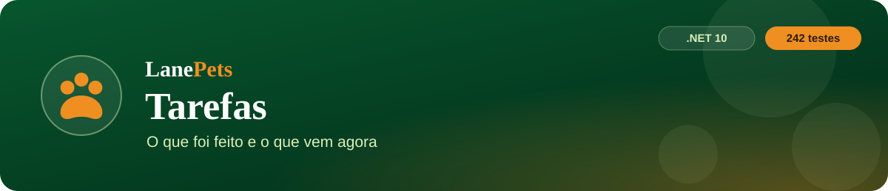
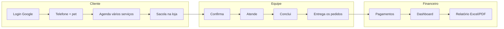
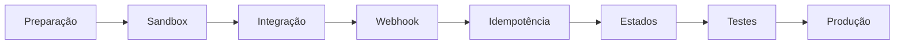

  

  
  
  
  

  <a href="PRD.md">PRD</a> ·
  <a href="architecture.md">Arquitetura</a> ·
  <a href="rules.md">Regras</a> ·
  <a href="design.md">Design</a> ·
  <b>Tarefas</b> ·
  <a href="memory.md">Memória</a>

> [!NOTE]
> Ordem de trabalho definida pelo Fabrício em 28/09/2026. Atualizado em **29/09/2026**.
> Ritmo: **uma etapa por vez, com validação dele antes de continuar.**

---

## 📋 Resumo

| # | Tarefa | Status | Testes |
|:-:|---|:-:|:-:|
| — | 🏗️ Desenvolvimento principal (20 itens do roadmap + extras) | ✅ | 173 |
| 1 | 🔐 Login com Google | ✅ | 228 |
| 2 | 🧪 Testar o Login com Google | ✅ | 234 |
| ➕ | 🎨 Rodada de melhorias das telas | ✅ | 242 |
| 🔒 | 🛡️ **Segurança antes do deploy** — Etapa 1 ✅ · Etapa 2 falta validar · Etapa 3 próxima ([`security.md`](security.md)) | 🔴 **agora** | 249 → 254 |
| 3 | 🚀 **Deploy no Railway** | depois da segurança | — |
| 4 | 🧪 Teste completo em produção | ⏳ | — |
| 5 | 📄 Atualizar README | ⏳ | — |
| 6 | 💼 Atualizar LinkedIn | ⏳ | — |
| 7 | 🔧 Melhorias futuras | 🔵 depois | — |
| 8 | 💳 Gateway de pagamento | ⚪ não agora | — |

```mermaid
flowchart LR
    D[✅ Desenvolvimento<br>principal] --> T1[✅ 1 · Google] --> T2[✅ 2 · Testes<br>do Google] --> R[✅ Rodada<br>de telas] --> T3[🚀 3 · Railway] --> T4[4 · Teste em<br>produção] --> T5[5 · README] --> T6[6 · LinkedIn] --> T7[7 · Melhorias] --> T8[8 · Gateway]
    style T3 fill:#ef8f22,stroke:#d97d12,color:#2a1a05
    style D fill:#e7f3e9,stroke:#1f7a45
    style T1 fill:#e7f3e9,stroke:#1f7a45
    style T2 fill:#e7f3e9,stroke:#1f7a45
    style R fill:#e7f3e9,stroke:#1f7a45
```

## ✅ Concluído

<b>🏗️ Desenvolvimento principal</b> (173 testes)

- Autenticação e permissões (perfil Funcionário), dados do cliente, gestão dos pets (ficha, foto), agendamento completo.
- Unidades, produtos e estoque em livro, pagamentos, dashboard, imagens em data URI.
- Arquitetura em Services, testes e CI, validações, erros `ERR-xxxx`, log de eventos.
- Busca e filtros, responsividade, design system, banco (backup, índices, integridade).
- Cobrança mensal do seguro, avaliação só com login, paginação no servidor.
- E-mails ao tutor + lembrete da véspera, recuperação de senha (cliente e painel), confirmação automática por unidade.
- Sino de pendências, pronto para hospedar, modo visitante, relatório Excel/PDF, cartão fidelidade.

<b>🔐 Tarefa 1 — Login com Google</b> (228 testes)

1. Configuração (`GET /api/cliente/google/config`).
2. Validação do ID token (RS256/JWKS, sem pacote).
3. Primeiro acesso e vinculação (`GoogleSub`).
4. Endpoint `POST /api/cliente/google`.
5. Tela (botão oficial, vincular, "complete seu cadastro").
6. Preparação para o Railway (`/api/health` com `google`).

<b>🧪 Tarefa 2 — Testes do Google</b> (234 testes)

- 6 testes de regressão (`LoginGoogleRegressaoTests`).
- Teste à mão com a conta Google real, sem problemas.
- Regra nova: **telefone obrigatório** para agendar, pedir e contratar seguro.

<b>🎨 Rodada de melhorias das telas</b> (242 testes, commit e push feitos)

- **Backend:** vários serviços por agendamento (até 6) e sacola da loja (`POST /api/cliente/pedidos/lote`).
- **Site:** home inteira redesenhada; unidades e contato juntos.
- **Área do cliente:** Avaliações · Agendar · Loja · Seguro · Pagamentos · Meus Pedidos · Meus Agendamentos · Histórico.

## 🚀 Tarefa 3 — Deploy no Railway (próxima)

- [ ] 🔗 Conta e projeto no Railway ligados ao repositório `Miguel33-Dev/lanpets` (branch `master`), build pelo Dockerfile.
- [ ] 💾 Volume montado em `/app/data`: banco, backups, e-mails `.txt` e logs.
- [ ] 🔑 Variáveis de ambiente:

  | Variável | Valor |
  |---|---|
  | `LanePets__AdminSenhaInicial` | 8+ caracteres, com letra e número (não pode ser `123456`) |
  | `LanePets__FinancePassword` | mesma regra |
  | `LanePets__Google__ClientId` | o Client ID do Google |
  | `LanePets__Email__*` | SMTP (opcional) |
  | `LanePets__UrlPublica` | endereço do site (opcional) |

- [ ] 🔐 Google Cloud:
  - Adicionar a origem `https://<app>.up.railway.app` no cliente "LanePets Web".
  - **Publicar o app** em Público-alvo.
  - Conferir `/api/health` → `google: true`.
- [ ] 🌍 Domínio.
- [ ] 📝 Registrar o link no README e no [`memory.md`](memory.md).

## 🧪 Tarefa 4 — Teste completo em produção

- [ ] Cliente
- [ ] Equipe
- [ ] Financeiro

## 📄 Tarefa 5 — Atualizar README

- [ ] **Conteúdo:** descrição, funcionalidades (vários serviços e sacola), stack e arquitetura, segurança, Login Google.
- [ ] **Números:** total de testes (242).
- [ ] **Uso:** Docker e Railway, como executar, estrutura do projeto.
- [ ] **Extras:** link da aplicação e prints das telas novas (as imagens de `docs/img/` servem).

## 💼 Tarefa 6 — Atualizar LinkedIn

- [ ] **Conteúdo:** evolução PHP → Laravel → .NET 10, arquitetura, testes, segurança, área do cliente, painel, Google, deploy.
- [ ] **Material:** atualizar os números no `lanepets-linkedin-v2.png`, no `lanepets-linkedin-textos.md` e no `lanepets-video.mp4`, e usar as telas redesenhadas.

## 🔧 Tarefa 7 — Melhorias futuras

| Área | Ideia |
|---|---|
| ✉️ E-mail | outra conta de envio (hoje o e-mail para o próprio remetente do Gmail cai em Enviados) |
| 🗄️ Banco | avaliar o crescimento e tirar Cadastro e Entradas e Saídas do LaneStore |
| 🔔 Notificações | internas e no site |
| 🔐 Conta só-Google | "Criar senha" direto na Minha Conta |
| 📅 Agendamento | filtrar serviços pelo porte do pet; redesenhar a etapa Revisão (7) |
| 🗂️ Cadastros no painel | unificar "Acessório"/"Acessórios" e serviços com nomes quase iguais |
| 🖼️ Loja | fotos nos produtos |
| 🔑 Google Cloud | excluir a chave secreta do cliente OAuth (não é usada) |

## 💳 Tarefa 8 — Gateway de pagamento

> [!WARNING]
> **Não fazer agora.** Mercado Pago ou Stripe em modo de teste, quando chegar a vez.

